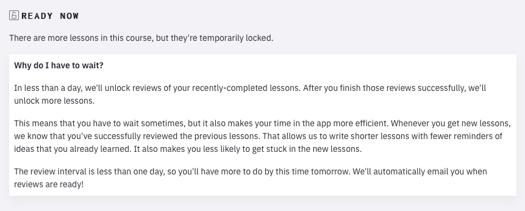

---
aliases:
  - Execute Program’s lessons don’t unlock until you’ve successfully reviewed their prerequisites
created: 2026-05-26
modified: 2026-06-10
---

Học viên của [[Execute Program]] không thể truy cập ngay tất cả bài học trong một khóa. Hầu hết bài học bắt đầu ở trạng thái "khóa." Những bài học đó phụ thuộc vào các bài học khác trong khóa: ban đầu, chỉ những bài không có bài phụ thuộc mới được mở khóa. Một bài học chỉ mở khóa khi tất cả bài phụ thuộc của nó không chỉ đã được đọc, mà còn được ôn tập gần đây (thông qua cơ chế [[Hệ thống ghi nhớ lặp lại ngắt quãng]] được nhúng sẵn).

Cách này cho phép người thiết kế khóa học viết các bài học tập trung hơn: [[Các bài học của Execute Program giả định việc nhớ lại vững chắc tài liệu trước đó]].

Đây là cách giao diện của họ giải thích cơ chế này:

Cách tiếp cận này gợi ý một cách hiện thực hóa [[Phương tiện ghi nhớ có thể được thiết kế để mở ra trải nghiệm theo thời gian]]: thay vì viết sách giáo khoa, hãy viết một chuỗi bài học cực kỳ tập trung, rồi đưa chúng đến người học theo thời gian khi họ củng cố kiến thức.

---

H. Tại sao các bài học của Execute Program vẫn bị khóa cho đến khi học viên hoàn thành các bài tiên quyết?
Đ. Để các bài học có thể được viết thật tập trung, không cần nhắc lại các bài tiên quyết đó.