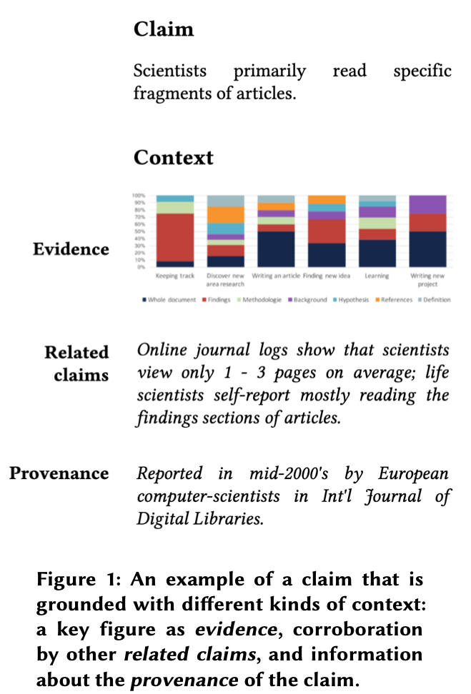

---
aliases:
  - Grounded claims, after Qian et al
created: 2026-05-26
modified: 2026-06-11
---

Khi các nhà nghiên cứu tổng hợp tri thức, chẳng hạn bằng cách đọc tài liệu học thuật, họ phải lắp ráp một mạng lưới kết nối dày đặc gồm các "khẳng định có cơ sở": những phát biểu chính xác có đủ ngữ cảnh (nguồn, bằng chứng, phạm vi, kết nối) để nhà nghiên cứu có thể dùng chúng trong thực tế.

Khái niệm này liên quan đến thực hành của tôi trong việc tách ghi chú sao cho chúng có tiêu đề sắc bén, hoạt động như các API ([[Tiêu đề ghi chú thường xanh giống như API]]). Cả hai khái niệm đều nhấn mạnh tính nguyên tử và sự chính xác. Các khẳng định có cơ sở nhấn mạnh bằng chứng và nguồn gốc ở mức cao hơn. Tiêu đề ghi chú thường xanh có phạm vi rộng hơn phần nào, vì chúng không nhất thiết cố trở thành các phát biểu về sự thật (ví dụ: [[Năng lực phi thường di truyền tới mức nào]]).

Hình minh họa này (Qian và cộng sự, 2019) thể hiện một khẳng định cùng ngữ cảnh làm cơ sở cho nó:

---

> [!info]- Tài liệu tham khảo
> Qian, X., Erhart, M. J., Kittur, A., Lutters, W. G., & Chan, J. (2019). Beyond iTunes for Papers: Redefining the Unit of Interaction in Literature Review Tools. Conference Companion Publication of the 2019 on Computer Supported Cooperative Work and Social Computing, 341–346. https://doi.org/10.1145/3311957.3359455 [[Qian và cộng sự - Vượt ra ngoài iTunes cho Bài báo - Tái định nghĩa Đơn vị Tương tác trong Công cụ Tổng quan Tài liệu]]
