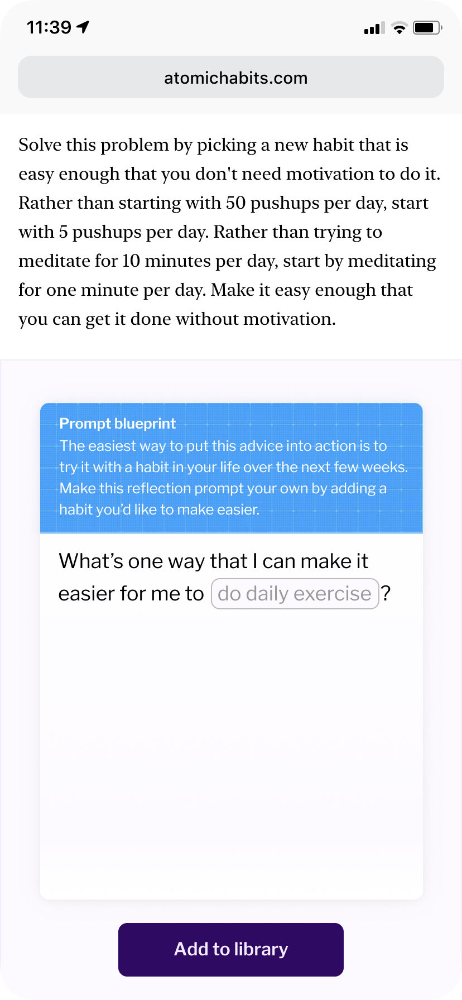

---
aliases:
  - Embedded prompt templates may actively scaffold prompt-writing for mnemonic medium readers
created: 2026-05-26
modified: 2026-06-11
---

[[Phương tiện ghi nhớ có thể giúp dựng bộ khung cho việc viết prompt thông qua các prompt do tác giả cung cấp]], nhưng đôi khi việc người đọc tự viết câu hỏi của mình lại đặc biệt quan trọng. Điều này nhất là đúng khi tác động mong muốn mang tính cá nhân nhiều hơn là trí tuệ, như trong [[Lặp lại ngắt quãng giúp hình thành và thay đổi thói quen]]. Trong những tình huống đó, nếu tác giả có thể giúp người đọc tự viết câu hỏi thì sao? Có lẽ họ có thể cung cấp một bộ mẫu câu hỏi để người đọc tùy chỉnh, rồi xen trực tiếp chúng vào trải nghiệm đọc như trong bản phác thảo này:

Cơ chế này sẽ phụ thuộc nhiều vào việc trả lời tốt câu hỏi [[Phương tiện ghi nhớ có thể thích nghi với nền tảng và mục tiêu khác nhau của độc giả như thế nào_]]. Đây là loại tương tác rất dễ khiến người đọc thấy phiền.

Có lẽ phần gõ chữ nên được đưa "lên trên" câu hỏi, để nhiều câu hỏi có thể được tạo ra từ một phản hồi duy nhất. Ví dụ: "Tôi cảm thấy có những trở ngại nào khi cố gắng tập thể dục hằng ngày?" và "Một điều mới tôi có thể thử để việc tập thể dục hằng ngày dễ hơn là gì?". Phần trống trong cả hai mẫu sẽ được điền bằng thói quen đã chọn.

Một biến thể khác là đặt cơ chế này trong dạng câu hỏi nhiều phần, giống như một thẻ mở ra kiểu origami: "Ngay lúc này, thói quen nào bạn có cảm giác bản năng rằng mình muốn làm cho đáng tin cậy hơn?" / "Bạn cảm thấy có những trở ngại nào khi cố gắng thực hiện thói quen đó?" / "Bạn có thể giảm bớt các trở ngại đó, hoặc làm cho việc thực hiện thói quen đó dễ hơn, bằng cách nào?" Với loại câu hỏi nhiều phần này, có thể không cần tương tác gõ chữ: các câu hỏi sau chỉ cần nhắc lại câu trả lời từ các câu trước.

Một khả năng liên quan: [[Các câu nhắc phản tư có thể ghi lại và tích lũy phản hồi theo thời gian]]

---

> [!info]- Tài liệu tham khảo
> 
> Cuộc trò chuyện với Taylor Rogalski, 2020-05-10
