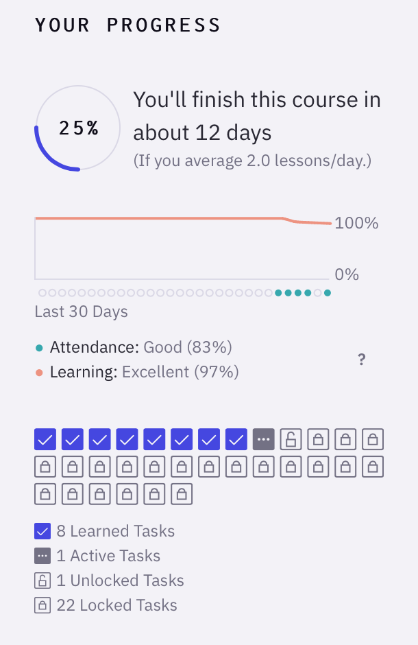

---
aliases:
  - Execute Program’s progress mechanics emphasize completing new lessons over increasing recall duration
created: 2026-05-26
modified: 2026-06-11
---

Các bài học trên [[Execute Program]] có bốn trạng thái:

1. Khóa (khi một hoặc nhiều bài tiên quyết chưa ở trạng thái Đã học; xem [[Các bài học của Execute Program không mở khóa cho đến khi bạn đã ôn tập thành công các bài tiên quyết]])
2. Mở khóa (khi tất cả bài tiên quyết đã ở trạng thái Đã học nhưng bạn chưa làm qua bài đó)
3. Đang hoạt động (khi bạn đã làm qua bài học nhưng chưa ôn tập)
4. Đã học (khi bạn đã ôn tập bài học ít nhất một lần)

Cách trình bày dừng lại ở "Đã học", trạng thái đạt được khi người đọc chỉ ôn tập bài học một lần. Nó không phân biệt giữa khả năng ghi nhớ đã được chứng minh trong một tháng và trong một ngày.

Đây là bảng điều khiển khóa học trên Execute Program:

Vòng tròn phía trên đại diện cho tỷ lệ bài học trong khóa đã ở trạng thái Đã học. Vậy bạn "hoàn thành" khóa học khi tất cả bài học đều ở trạng thái Đã học, ngay cả khi khoảng cách SRS của chúng chỉ là một hoặc hai ngày.

Điều này tạo ra một tương phản thú vị với [[Quantum Country]], nơi tiến trình hoàn toàn gắn với việc đạt được các mức độ bền vững ngày càng cao của trí nhớ.

Một hệ quả thú vị của cách đóng khung này là khi người dùng đã ôn tập tất cả bài học trong khóa một lần, nói chung họ cảm thấy như đã "xong". Họ vẫn nhận được thông báo ôn tập, nhưng giao diện không gắn bất kỳ mục tiêu có ý nghĩa nào cho các lần ôn đó, nên nhiều người dùng có khả năng sẽ bỏ cuộc tại thời điểm này.

----------

Q. Điều gì cấu thành việc "hoàn thành" một bài học trên Execute Program?
A. Làm qua nó và ôn tập ít nhất một lần.

Q. Trọng tâm cơ chế tiến trình của Execute Program khác với Quantum Country như thế nào?
A. Nó nhấn mạnh tiến trình ban đầu qua các bài học của khóa hơn là tiến trình dài hạn tăng khoảng cách SRS.
