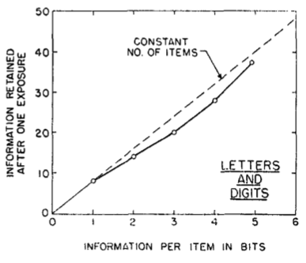

---
aliases:
  - Human channel capacity increases with bits-per-chunk
created: 2026-05-26
modified: 2026-06-10
---
Một cách phổ biến để vượt qua giới hạn của [[Dung lượng kênh của con người với tư cách bộ xử lý thông tin]] dường như là thực hiện một chuỗi quan sát nhỏ hơn, thay vì đưa ra một phán đoán tuyệt đối phức tạp duy nhất. Cách này chỉ hiệu quả nếu bạn có thể giữ cả chuỗi trong đầu, nên nó bị giới hạn bởi [[Khoảng bộ nhớ làm việc]]. May mắn là [[Dung lượng bộ nhớ làm việc phần lớn độc lập với độ phức tạp của mục]]. Vì vậy, bạn có thể tăng dung lượng kênh hiệu dụng bằng cách tăng số bit trong mỗi khối quan sát ([[Các mảnh trong nhận thức con người]]).

Hình dưới đây mô tả dữ liệu từ Pollack (1953): dung lượng kênh tăng gần như tuyến tính theo số bit trên mỗi khối (Miller, 1956, tr. 92).

Hiệu ứng này vẫn bị giới hạn bởi [[Khoảng phán đoán tuyệt đối]]. Vì vậy, để mở rộng số bit trên mỗi khối vượt quá 5, bạn cần làm cho các khối trở nên đa chiều ([[Dung lượng kênh của con người tăng theo số chiều kích thích]]).

---

H. Dung lượng kênh của con người thay đổi như thế nào đối với một chuỗi các phần tử, khi số bit truyền trong mỗi phần tử tăng?
Đ. Nó tăng gần như tuyến tính.

H. Tại sao việc khoảng bộ nhớ làm việc gần như độc lập với khoảng phán đoán tuyệt đối lại quan trọng?
Đ. Nó gợi ý rằng ta có thể giữ nhiều thông tin hơn trong bộ nhớ làm việc bằng cách tăng kích thước "khối" của các mục được giữ trong bộ nhớ.

---

#### Tham khảo
Miller, G. A. (1956). The magical number seven, plus or minus two: Some limits on our capacity for processing information. Psychological Review, 63(2), 81–97. https://doi.org/10.1037/h0043158 [[Miller - Con số kỳ diệu bảy, cộng hoặc trừ hai]]

Pollack, I. (1953). Assimilation of Sequentially Encoded Information. The American Journal of Psychology, 66(3), 421–435. JSTOR. https://doi.org/10.2307/1418237
