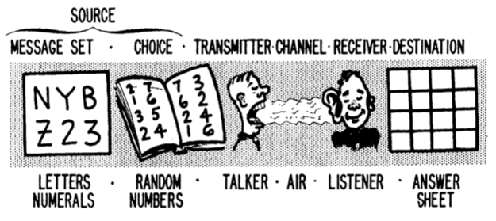
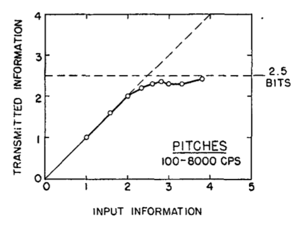

---
aliases:
  - Channel capacity of humans as information processors
created: 2026-05-26
modified: 2026-06-11
---

Một cách xem xét giới hạn xử lý thông tin của con người là hỏi: một người có thể tái tạo bao nhiêu thông tin từ một kích thích mà họ quan sát? Trong khung này, ta có thể mô hình hóa người quan sát như một kênh truyền thông và dùng công cụ của lý thuyết thông tin để phân tích. Hình này (Pollack, 1953, trang 422) mô tả mô hình đó:

Một kênh truyền thông hoàn hảo có thể tái tạo bất kỳ đầu vào nào bạn đưa vào. Trong thực tế, hầu hết các kênh (bao gồm con người) tạo ra nhiều lỗi hơn khi đầu vào chứa nhiều thông tin hơn. Hành vi này thường có dạng tiệm cận: kênh truyền đầu vào gần như hoàn hảo cho đến một ngưỡng nào đó. Khi vượt ngưỡng đó, tức {*dung lượng kênh*}, tương quan giữa đầu ra và đầu vào giảm xuống, còn tổng số bit thông tin được truyền đi giữ nguyên.

Các thí nghiệm về [[Khoảng phán đoán tuyệt đối]] của con người có thể dùng để mô hình hóa con người theo cách này. Tổng quan của Miller (1956) về dữ liệu thực nghiệm gợi ý rằng dung lượng kênh của con người với các kích thích đơn chiều vào khoảng {2,6} bit.

Ví dụ, đây là một hình từ Miller (1956, trang 83), dùng dữ liệu thực nghiệm từ Pollack (1952, 1953) về phán đoán tuyệt đối của con người với cao độ, được diễn giải lại bằng khung lý thuyết thông tin.

---

H. Nếu bạn biết phạm vi phán đoán tuyệt đối của một đối tượng (với các cường độ đơn chiều, đơn mục), bạn sẽ tìm dung lượng kênh của họ như thế nào?
Đ. dung lượng kênh = log_2(phạm vi phán đoán tuyệt đối)

H. Tại sao phạm vi phán đoán tuyệt đối liên quan đến dung lượng kênh của con người bằng quan hệ log2?
Đ. Dung lượng kênh được biểu thị bằng bit. Nếu phạm vi phán đoán tuyệt đối là 8 loại, bạn cần log2(8) bit để biểu diễn mọi trạng thái.
---

> [!info]- Tài liệu tham khảo (References)
> Miller, G. A. (1956). The magical number seven, plus or minus two: Some limits on our capacity for processing information. Psychological Review, 63(2), 81–97. https://doi.org/10.1037/h0043158 [[Miller - Con số kỳ diệu bảy, cộng hoặc trừ hai]]
> 
> Pollack, I. (1952). The Information of Elementary Auditory Displays. The Journal of the Acoustical Society of America, 24(6), 745–749. https://doi.org/10.1121/1.1906969
> 
> Pollack, I. (1953). Assimilation of Sequentially Encoded Information. The American Journal of Psychology, 66(3), 421–435. JSTOR. https://doi.org/10.2307/1418237
