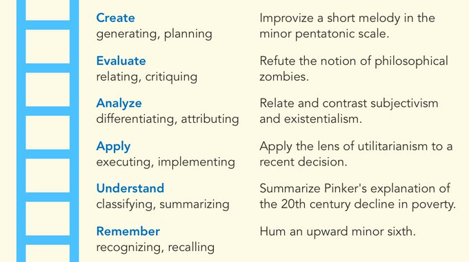

---
aliases:
  - Spaced repetition memory systems can be used to prompt application, synthesis, and creation
created: 2026-05-26
modified: 2026-05-30
---
Một [[Hệ thống ghi nhớ lặp lại ngắt quãng]] như Anki chủ yếu được thiết kế để giúp mọi người ghi nhớ nhiều kiến thức khai báo, như từ vựng. Nhưng các cơ chế tương tự có thể được sử dụng để tạo các thẻ tương đối khác thường nhằm thúc đẩy ứng dụng, tổng hợp và sáng tạo.

Một giới hạn của những loại câu hỏi này là vì *bạn* là người viết chúng, bạn phải để bối cảnh tương đối mơ hồ: "áp dụng lăng kính của chủ nghĩa vị lợi vào một quyết định gần đây", thay vì "áp dụng lăng kính của chủ nghĩa vị lợi vào án tử hình." Câu hỏi sau không hữu ích lắm nếu bạn đã viết nó: bạn đã suy nghĩ qua câu trả lời rồi, nên thực chất nó chỉ là một câu nhắc ghi nhớ khi bạn nhìn lại sau này. Giới hạn này làm cho ý tưởng được mô tả ở đây trở nên hứa hẹn: [[Phương tiện ghi nhớ có thể giúp người đọc áp dụng những gì họ đã học qua prompt ứng dụng đơn giản]].

Liên quan:
- [[Các ứng dụng lạ của hệ thống ghi nhớ lặp lại ngắt quãng]]
- [[Lặp lại ngắt quãng giúp hình thành và thay đổi thói quen]]
- [[Dùng lặp lại ngắt quãng để lập trình sự chú ý]]

---

> [!info]- Tài liệu tham khảo
> Bài đăng Twitter, 2018-03-11: https://twitter.com/andy_matuschak/status/973020621847187456
> 
> Cuộc trò chuyện với Michael Nielsen, 2020-01-01