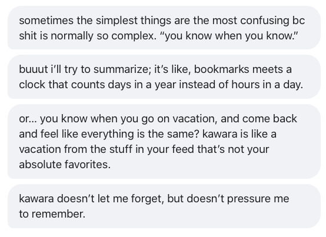
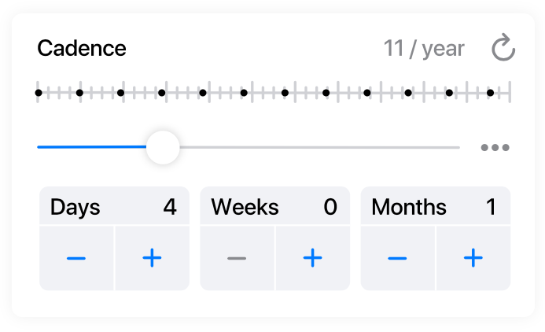
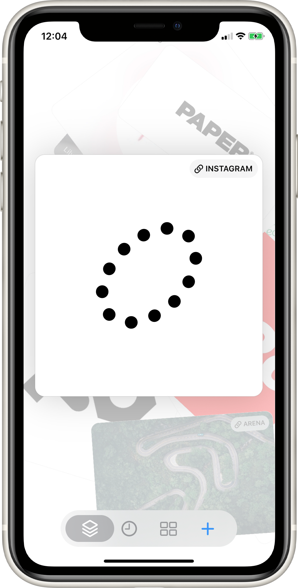
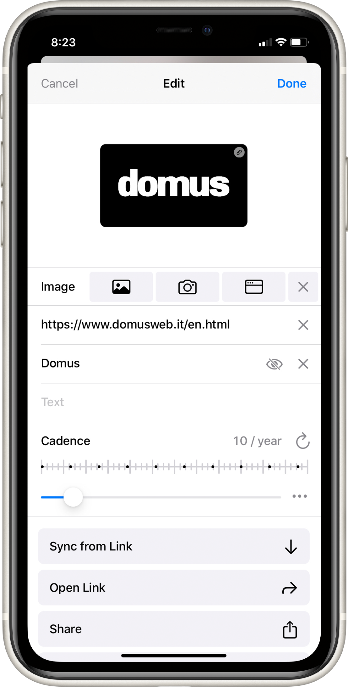
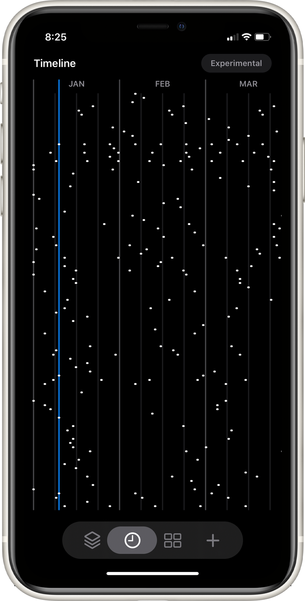
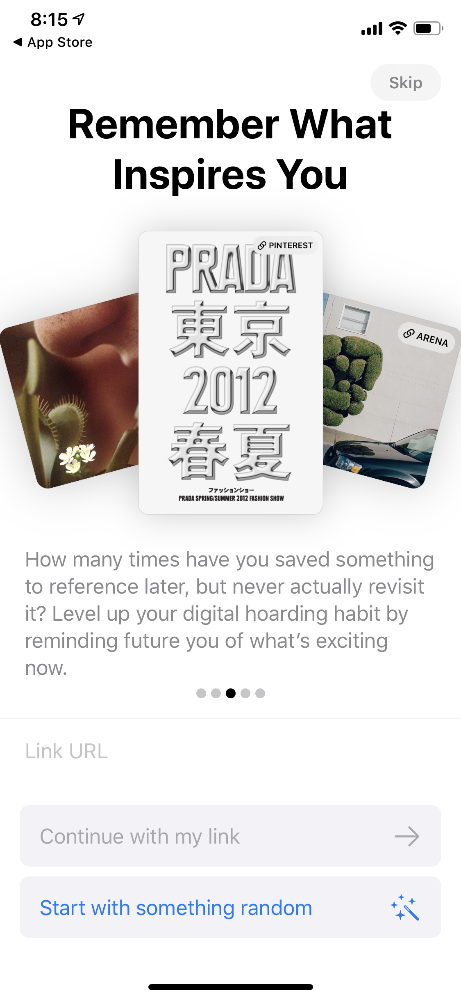
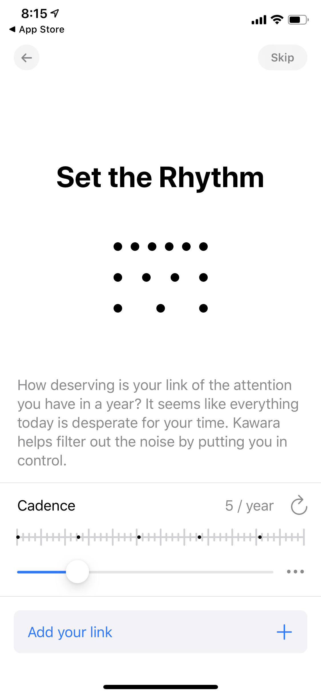
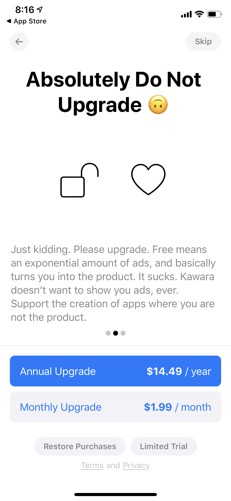
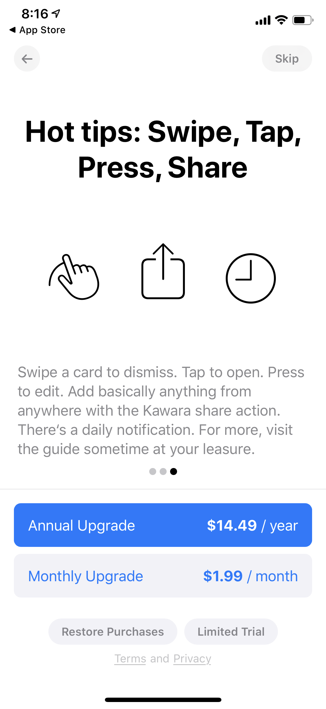
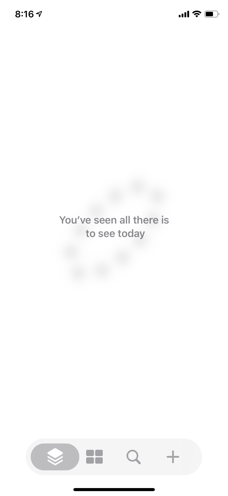

[Kawara](https://www.kawara.app/) là một ứng dụng iOS được tạo ra vào đầu năm 2020, thu thập và trình bày nội dung định kỳ theo thời gian trong các phiên xem hàng ngày. Đây là một loại [[Lặp lại ngắt quãng cho mọi thứ]], không có bất kỳ hành động tương tác cụ thể nào với các mục — bạn chỉ xem một thứ và tiếp tục sang thứ tiếp theo.

Giải thích một câu cho báo chí của họ:

> Kawara helps alleviate social media burnout and cultivation of healthier habits by providing a daily collection of things you want to remember; people, music, art, anything.
> (Kawara giúp giảm bớt sự kiệt sức từ mạng xã hội và xây dựng các thói quen lành mạnh hơn bằng cách cung cấp một bộ sưu tập hàng ngày những thứ bạn muốn ghi nhớ; con người, âm nhạc, nghệ thuật, bất cứ điều gì.)

Nhưng đó hoàn toàn không phải cách Kawara tự giới thiệu với người tiêu dùng:

Đây là về trí nhớ, theo một nghĩa nào đó, nhưng theo cách nhẹ nhàng: "kawara doesn't let me {forget}, but doesn't {pressure} me to {remember}." (kawara không để tôi {quên}, nhưng cũng không {ép buộc} tôi phải {nhớ}.) Xem [[Cơ chế lặp lại ngắt quãng tạo ra cảm giác dễ dàng]].

Nó được tạo ra bởi {Jon-Kyle Mohr}, một nghệ sĩ-công nghệ có trụ sở tại {Los Angeles}. Mô hình kinh doanh là đăng ký \${2}/tháng. Có vẻ như đây là một dự án phụ nhỏ của tác giả.

#### Cơ chế hoạt động (Mechanics)

Điều gì xảy ra nếu bạn bỏ qua một ngày? Liệu các mục có tích lũy lại, hay chúng chỉ bị bỏ qua? Chưa rõ.

Không có "cơ chế tiến trình" nào cả, và không có điều chỉnh động về nhịp độ. Bạn được yêu cầu chọn nhịp độ khi thêm một mục, và vậy là xong. Tôi cảm thấy đây là một lựa chọn kỳ lạ: tôi thường không biết khi lần đầu nhìn thấy thứ gì đó tôi muốn thấy nó bao lâu một lần. Phải chọn cảm thấy nặng nề và khó chịu. Tôi không nghĩ mình thường sẽ chọn đúng. Và việc điều chỉnh khoảng thời gian trực tiếp thì rất rườm rà. Nhưng có lẽ đây là tối ưu hóa quá mức. Có lẽ một lựa chọn khoảng thời gian theo bản năng thô là ổn, đặc biệt đối với các bộ sưu tập nhỏ?

Q. Khoảng thời gian của các mục trong Kawara được đặt như thế nào?
A. Chúng được người dùng chỉ định thủ công tại thời điểm nhập liệu.

#### Trình bày (Presentation)

Trang web marketing trình bày ứng dụng theo phong cách rất "millennial". Nó đang ngồi trên ghế bãi biển, đeo kính mát và quần shorts, và hơi lơ mơ một chút. Nó hơi điệu quá theo gu của tôi, nhưng thực sự thành công trong việc tách biệt định dạng này khỏi "hiệu quả bộ nhớ" kiểu Spockian. Hầu hết các ví dụ marketing tập trung vào tài liệu thẩm mỹ, cảm hứng sáng tạo, v.v. Một cách có ý nghĩa, nó có tích hợp are.na. Không phải mục đích, mà là "để xem những thứ hay." Đây là một giải pháp thú vị cho [[Quan niệm hiện tại về Orbit quá tập trung vào trí nhớ; thơ ca ở đâu_]].

Việc nhấn mạnh vào việc quay lại những thứ bạn thấy thú vị, nhưng không có hình thức tương tác cụ thể nào, khá giống với [[Readwise]]. Danh sách highlights đơn giản của Readwise không phù hợp với tôi: mắt tôi lướt qua, rồi tôi lưu trữ email mà không thực sự tương tác. Nhưng có lẽ tài liệu hình ảnh thực sự khác nhau.

[Video marketing sản phẩm](https://tesla.s3.amazonaws.com/2019/kawara-intro.mp4) của họ có phong cách khác, hơi Instagram-sunshine-aspirational hơn, nhưng vẫn có tính thơ. Bài giới thiệu tập trung vào việc tránh trì hoãn và phân tâm.

> By using intervals to set a cadence, we can keep it a little healthier, and better inhabit the little time we have. Kawara lets you follow anything, anywhere on your own time—from once every few days to every few months. Instead of updating constantly, it provides you with a daily collection and doesn't update again until tomorrow. All in time: Kawara.
>
> (Bằng cách sử dụng các khoảng thời gian để tạo nhịp điệu, chúng ta có thể giữ nó lành mạnh hơn một chút, và tận dụng tốt hơn khoảng thời gian ít ỏi chúng ta có. Kawara cho phép bạn theo dõi bất cứ điều gì, ở bất cứ đâu theo thời gian của riêng bạn — từ vài ngày một lần đến vài tháng một lần. Thay vì cập nhật liên tục, nó cung cấp cho bạn một bộ sưu tập hàng ngày và không cập nhật lại cho đến ngày hôm sau. Tất cả đúng lúc: Kawara.)

Họ có một hình ảnh trực quan về nhịp điệu rất thú vị:

Tôi không thực sự biết cách đọc điều này, nhưng nó chắc chắn gợi cảm xúc.

---

(qua [[Taylor Rogalski]], 2020-06-02)
