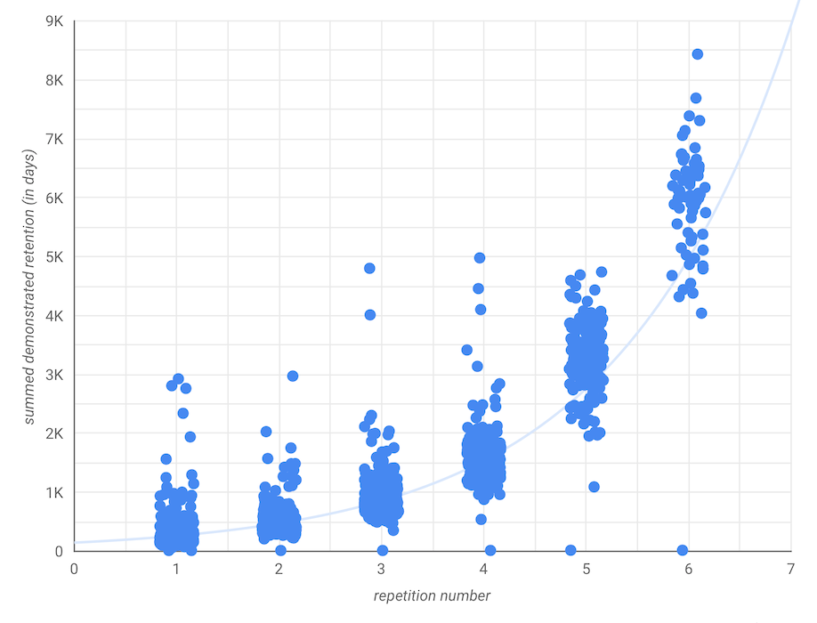

---
aliases:
  - Quantum Country readers reliably develop detailed retention
created: 2026-05-26
modified: 2026-06-11
---

Tất cả dữ liệu này đến từ những người đọc đã trả lời hơn 80% câu hỏi [[QCVC]] trong bài luận trước phiên ôn tập đầu tiên của họ.

Sau 6 lần lặp lại (dùng lịch trình SRS trước đó, ít tích cực hơn), hầu hết người dùng 2019H1 trung bình giữ lại mỗi câu hỏi khoảng 54 ngày.

Người đọc trung vị 2019H2 đã chứng minh khả năng giữ lại 2 tuần trên hơn 95% câu hỏi QCVC vào phiên 9. [Nguồn](https://datastudio.google.com/u/0/reporting/1VtXKXFeHu2ItURkfTuFbGsWYetYMZkUe/page/h446/edit) Những người dùng này trung bình giữ lại mỗi câu hỏi khoảng 24 ngày sau 3 lần lặp lại. Chúng tôi chưa có dữ liệu về các lần lặp sau đó.

Nhưng đây có phải chỉ là hiệu ứng sống sót không? Liệu những người đọc này có phát triển khả năng giữ lại như vậy trong mọi trường hợp không? Hay đây là hiệu ứng lựa chọn, tức những người đọc này vốn đã có khả năng giữ lại chi tiết của tài liệu này? [[Tác động nhân quả của các phiên ôn tập trong phương tiện ghi nhớ đến khả năng ghi nhớ của người đọc là gì_]]
