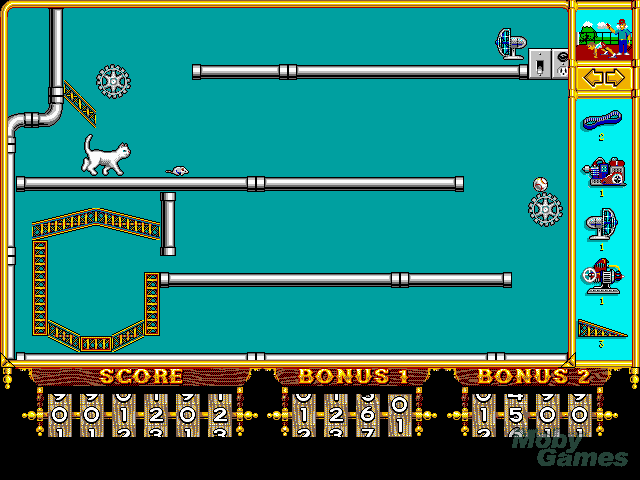

Được thiết kế bởi Kevin Ryan và ban đầu được phát hành vào năm 1993, loạt trò chơi này yêu cầu người chơi xây dựng các cỗ máy Rube Goldberg "giải quyết" các tình huống nhất định. Mỗi cấp độ có các thành phần được đặt sẵn trên màn hình và cung cấp cho người chơi một bộ "phần" họ có thể đặt để đạt được mục tiêu (thường là di chuyển một vật đến một vị trí cụ thể).

Hộp công cụ hạn chế đôi khi được sử dụng để làm cho các cấp độ thêm thách thức, nhưng chủ yếu là để giảm độ phức tạp không giới hạn và làm cho cấp độ có thể giải được ([[Ràng buộc như giàn giáo nhận thức]]). Các cấp độ được sắp xếp theo thứ tự để giới thiệu từng phần theo thời gian, dần dần kết hợp chúng trong các tổ hợp ngày càng phức tạp hơn: [[Các tiến trình nhiệm vụ chi tiết như là giàn giáo nhận thức]].

Trò chơi đầu tiên được lập trình trong chín tháng! Thật đáng kinh ngạc.
