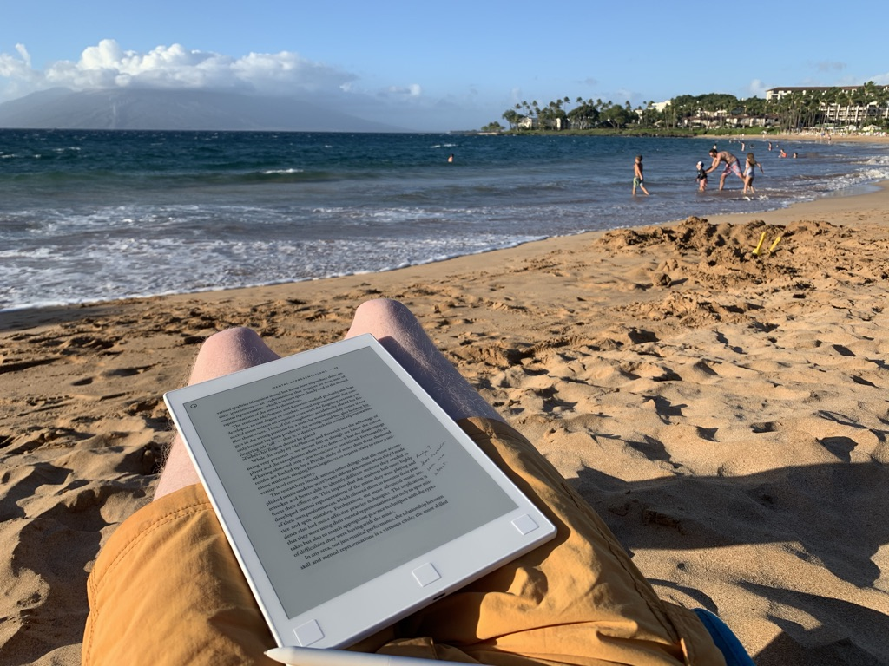

reMarkable là một máy tính bảng sử dụng mực điện tử được thiết kế để đọc và viết.
- Đọc và chú thích PDF trên bãi biển thực sự tuyệt vời. Đây là điểm quan trọng nhất.

- Thật tuyệt vời khi có thể đọc và chú thích PDF toàn trang thay vì EPUB.
- Thiết bị cực kỳ chậm, làm trầm trọng thêm [[Hiệu suất kém làm gián đoạn đọc phi tuyến tính trong đọc sách kỹ thuật số]]
- Quy trình làm việc để làm bất cứ điều gì với các chú thích được tạo trên thiết bị là tồi tệ. Trên thiết bị, người ta không thể tìm kiếm hoặc điều hướng nhanh chóng giữa chúng. Trên máy tính, chúng chỉ đơn giản được làm phẳng vào PDF. Và không có đồng bộ tự động nào cả. Tệ đến kinh ngạc.
- Trình đọc EPUB thực sự tệ: cực kỳ chậm, điều hướng đau đớn, v.v.
- Để đưa sách vào thiết bị cần sử dụng máy tính và phá DRM.
- Thiết kế hình dạng tuyệt vời: nhẹ, kích thước tốt, vật liệu tốt.
- Thời lượng pin kém nhưng chấp nhận được.
- Khá đắt ở mức \$500... nhưng đã được giảm giá còn \$279 vào tháng 5 năm 2020! Tôi đã trả lại của mình nhưng mua cái khác với giá thấp hơn.

#### Đồng bộ hóa
Tôi rất muốn đồng bộ thư viện trên ổ đĩa của mình với reMarkable. Tôi nghĩ mình sẽ phải dành ra một hai ngày và chỉ xây dựng chức năng đó.

Có một triển khai Typescript của API đám mây: [reMarkable-typescript/src at master · Ogdentrod/reMarkable-typescript · GitHub](https://github.com/Ogdentrod/reMarkable-typescript/tree/master/src)

Tài liệu về API ở đây: [Storage · splitbrain/ReMarkableAPI Wiki · GitHub](https://github.com/splitbrain/ReMarkableAPI/wiki/Storage)

Sau khi tải xuống các tệp lines, tôi có thể chuyển đổi chúng sang SVG bằng script này: [maxio/rm_tools at master · lschwetlick/maxio · GitHub](https://github.com/lschwetlick/maxio/tree/master/rm_tools)
